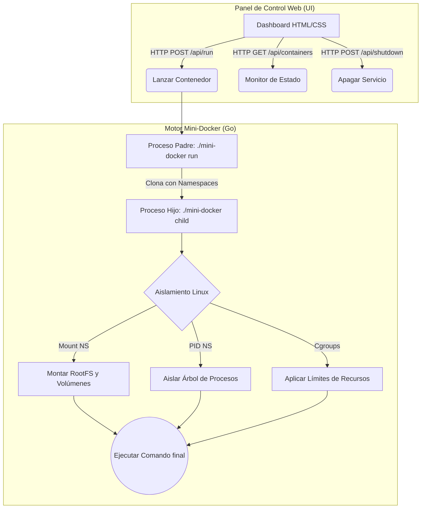

# Mini-Docker

<div align="center">
  
  
  
</div>

<br>

**Mini-Docker** es un motor de contenedores minimalista y educativo escrito en Go. Fue diseñado para entender cómo funciona la magia detrás de herramientas como Docker, construyendo contenedores desde cero utilizando las primitivas del núcleo de Linux: **Namespaces**, **Cgroups** y **Chroot/Mounts**.

Incluye un **Panel de Control Web** moderno e interactivo para gestionar y visualizar tus contenedores en tiempo real.

---

## Características Principales

* **Aislamiento de Procesos**: Utiliza Linux Namespaces (PID, UTS, Mount) para aislar completamente los procesos del contenedor del host.
* **Gestión de Recursos**: Soporte para *Cgroups v2* (experimental) para limitar el uso de CPU y memoria de los contenedores.
* **Montaje de Volúmenes**: Soporta el mapeo de directorios del host al contenedor mediante Bind Mounts, permitiendo compartir código y datos.
* **Variables de Entorno**: Inyección de configuración mediante variables de entorno aisladas para cada ejecución.
* **Interfaz Web Moderna**: Un dashboard con diseño *Glassmorphism* para lanzar contenedores de forma gráfica sin tocar la consola.

---

## Arquitectura del Sistema

El proyecto se divide en dos componentes principales: el **Motor (Backend en Go)** y el **Panel de Control (Frontend en JS/HTML)**.



---

## Requisitos Previos

Para ejecutar Mini-Docker, necesitas un entorno Linux, como Kali Linux o Ubuntu, ya que depende de características exclusivas de su kernel.

* Sistema operativo **Linux**
* **Go** instalado, versión 1.20 o superior recomendada
* Privilegios de **root** mediante `sudo` para manipular Namespaces y Cgroups

---

## Instalación y Configuración

1. **Clonar el repositorio:**

   ```bash
   git clone <tu-repositorio>
   cd Mini-Docker
   ```

2. **Descargar el RootFS base de Alpine Linux:**

   El contenedor necesita un sistema de archivos base desde el cual arrancar. Ejecuta el script incluido:

   ```bash
   chmod +x setup-rootfs.sh
   sudo ./setup-rootfs.sh
   ```

3. **Compilar el proyecto:**

   ```bash
   # Si compilas desde Windows para usarlo en Linux:
   env GOOS=linux GOARCH=amd64 go build -o mini-docker .

   # Si compilas directamente en tu máquina Linux:
   go build -o mini-docker .
   ```

---

## Uso del Panel de Control Web

La forma más fácil e interactiva de usar Mini-Docker es a través de su interfaz de usuario.

1. Inicia el servidor UI. Requiere privilegios de administrador:

   ```bash
   sudo ./mini-docker ui
   ```

2. Abre tu navegador y visita:

   ```text
   http://127.0.0.1:9000
   ```

3. Usa el panel para lanzar comandos, inyectar variables o montar volúmenes.

4. Usa el botón **Stop Service** en la interfaz para apagar el motor de forma limpia y segura.

---

## Uso por Consola

También puedes usar Mini-Docker directamente desde la terminal, de forma similar a `docker run`.

```bash
# Sintaxis básica
sudo ./mini-docker run [-v host:container] [-e KEY=VAL] <comando>

# Ejemplo 1: Una terminal interactiva
sudo ./mini-docker run /bin/sh

# Ejemplo 2: Variables de entorno
sudo ./mini-docker run -e MI_SECRETO=123 /bin/sh -c 'echo "Clave: $MI_SECRETO"'

# Ejemplo 3: Montaje de volúmenes
sudo ./mini-docker run -v /home/kali/Desktop/app:/shared /bin/sh -c 'ls -la /shared'
```

---

## Ejemplo Práctico: Python Web App

En la carpeta `app/` se incluye un servidor web ligero en Python con una vista moderna. Para ejecutarlo dentro de Mini-Docker:

1. Desde la interfaz web, completa los campos de la siguiente manera:

   * **COMMAND:** `apk add python3 && python3 /shared/server.py`
   * **ENVIRONMENT:** `PORT=8000`
   * **VOLUME:** `/ruta/absoluta/a/tu/carpeta/app:/shared`

   Ejemplo:

   ```text
   /home/kali/Desktop/app:/shared
   ```

2. Haz clic en **Run Container**.

3. Visita la siguiente dirección para acceder a la aplicación:

   ```text
   http://127.0.0.1:8000
   ```

---
